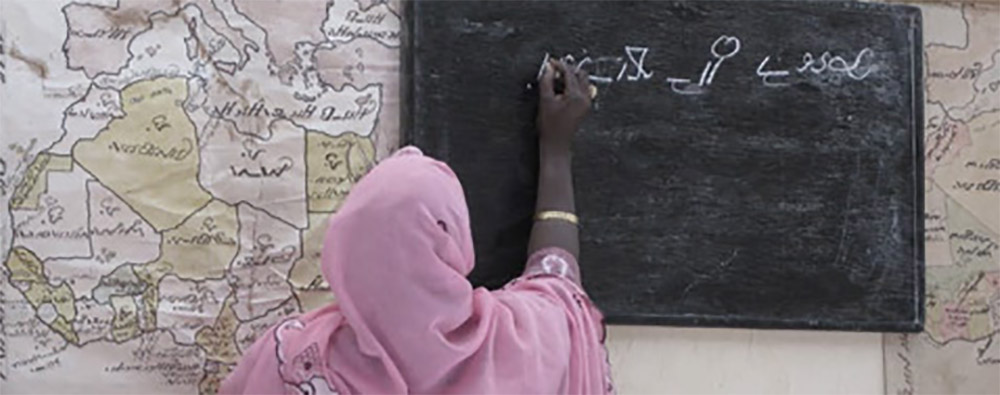

The Script Encoding Initiative (SEI), established in the [UC Berkeley Department of Linguistics](http://linguistics.berkeley.edu/) in April 2002, is a project devoted to the preparation of formal proposals for the encoding of scripts and script elements not yet currently supported in Unicode (ISO/IEC 10646). 

[Unicode](http://www.unicode.org/standard/WhatIsUnicode.html) is the universal computing standard specifying the representation of text in all modern software. To date, Unicode has largely focused on the major modern scripts, particularly those scripts most widely used in business. Some minority and historic scripts have already been encoded, as well as historic characters of the major modern scripts.

Over [100 scripts remain](scripts-to-encode.html) to be encoded. Minority scripts are still used in parts of South and Southeast Asia, Africa, and the Middle East. Unencoded scripts include Kpelle and Loma. Scripts of historical significance include Book Pahlavi, Large Khitan, and Jurchen. Even for major modern scripts there are many difficult historical issues remaining to be addressed: for example, the encoding model for Chinese (written continuously for nearly 3,000 years) is still being [refined](http://www.wenlin.com/cdl).

Because proposals for the encoding of minority and historical scripts often entail significant research, and their user communities have little economic or political voice, such script proposals have not been submitted to the Unicode Technical Committee (UTC) in any regular manner. It has been estimated that at the current slow pace of encoding, many scripts will still be unencoded in ten years. This means that effectively, many linguistic minorities and scholarly communities could be permanently left behind in the information age. For scholars who manage to work with obsolete computing technologies, their valuable data is destined for the electronic dust-bin, unless they move resolutely in the direction of modern computing standards.

The goal of the SEI project is to fund the preparation of script proposals that will be successfully approved by the Unicode Technical Committee and WG2 (ISO/IEC 10646) without requiring extensive revision or involvement of the committee itself.

A secondary goal to encourage the creation of freely-available Unicode-conformant fonts.

This will help to promote widespread adoption and implementation of the scripts.

By providing funding for proposal authors, drawn from faculty and graduate students as well as other experts, the Script Encoding Initiative represents a concerted effort to tackle the remaining scripts and remaining script issues. The project will be assisted by a Unicode Vice President to assure that the proposals meet requirements of the Unicode Technical Committee and of the international standards community. To date, the project has helped get over [90 scripts encoded](scripts-encoded.html).

The Script Encoding Initiative project is of world-wide importance, for minority and historic scripts. For a minority language, having its script included in the universal character set will help to promote native-language education, universal literacy, cultural preservation, and remove the linguistic barriers to participation in the technological advancements of computing. For historic scripts, it will serve to make communication easier, opening up the possibilities of online education, research, and publication.

For implementers in the computer industry, the outcome of this project will provide longer term stability for their development. Funding will be allocated on a per-proposal basis, depending upon the logistical complexity of encoding the script or script elements. The development of proposals will entail detailed script research and contact with both user communities and standardization bodies. The project is being led by Deborah Anderson, a Researcher in the Department of Linguistics and contributor to a number of Unicode script proposals, in conjunction with Unicode Vice President, Rick McGowan.